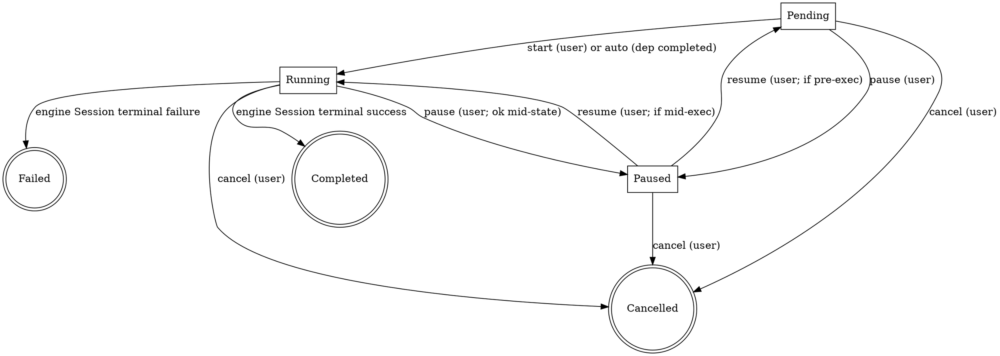

# Creator Schedule and Core Context — Specification v1

**Status**: Active — authoritative design input for V1.4 WS7 (formerly B-track, now folded into V1.4 per 2026-04-17 user direction).
**Author**: @project-manager (2026-04-17 prep-phase spec); to be co-signed by @architect before WS7 implement.
**Scope**: Multi-Schedule lifecycle per creator + the immutable versioned `core_context` that stabilises preset execution across edits.
**Wave-0 design inputs consumed**:

- [orchestration-engine-v1.md](../archived/knowledge/orchestration-engine-v1.md) — Task/Capability/Session primitives this spec builds on
- [v1.4-delivery-compass-v1.md](v1.4-delivery-compass-v1.md) — program-level scope and milestones
- [schemas-boundary-v1.md](../archived/knowledge/schemas-boundary-v1.md) — confirms Schedule / core_context types are **local** (not wire)

**Answers for open questions originally parked in `orchestration-engine-v1.md` §11**: OQ-1, OQ-2, OQ-3, OQ-4, OQ-5 are resolved here (see §2 "Confirmed Decisions"). OQ-6 is scoped for V1.4; OQ-7/OQ-8 remain V1.5+.

---

## Table of Contents

1. [Problem Statement](#1-problem-statement)
2. [Confirmed Decisions (locked)](#2-confirmed-decisions-locked)
3. [Data Model](#3-data-model)
4. [Schedule Lifecycle and State Machine](#4-schedule-lifecycle-and-state-machine)
5. [Multi-Schedule Concurrency (per creator)](#5-multi-schedule-concurrency-per-creator)
6. [`core_context` Derivation and Versioning](#6-core_context-derivation-and-versioning)
7. [Preset YAML Additions](#7-preset-yaml-additions)
8. [CLI Command Surface](#8-cli-command-surface)
9. [HTTP Surface (`/v1/local/orchestration/schedules/*`)](#9-http-surface-v1localorchestrationschedules)
10. [SQLite Schema Additions](#10-sqlite-schema-additions)
11. [Forward Compatibility with V1.5 Iteration](#11-forward-compatibility-with-v15-iteration)
12. [Migration / Implementation Steps](#12-migration--implementation-steps)
13. [Open Questions Deferred Past V1.4](#13-open-questions-deferred-past-v14)
14. [References](#14-references)

---

## 1. Problem Statement

The orchestration engine ([orchestration-engine-v1.md](../archived/knowledge/orchestration-engine-v1.md)) ships a `Session` primitive that can run one preset to completion. It does **not** answer:

1. **When** should the daemon start running preset `X` for creator `C`? ("daemon knows when to begin")
2. **What** does a user see when asking "what does my creator have planned for the next while?"
3. **How** does the user inject, modify, append, or delete the prompts that drive a pending / in-flight preset run? ("CRUD by ID")
4. **How** does preset execution stay stable against user edits? ("core_context 需要是稳定的")
5. **How** does each preset run's `core_context` evolve beyond the raw seed — into the actually-prompted "core context" the agent sees?

This document answers those five questions by defining **Creator Schedule** (queue of planned preset runs, user-visible, CRUD-able) and **`core_context`** (immutable versioned prompt state that the engine reads at execution boundaries).

## 2. Confirmed Decisions (locked)

From the 2026-04-17 brainstorming and its follow-up (item 3 of the 2026-04-17 PM reply):

- **Multi-Schedule per creator is supported** — one creator may have multiple Schedules.
- **Concurrency is declared per-add** — user says `--parallel-with <id>` (or similar) at `schedule add` time; default is serial (FIFO queued after existing Schedules of the same creator).
- **No priority / preemption in V1.4** — only explicit `schedule pause / resume / cancel` operations. Running Schedules are not interrupted by new higher-priority Schedules; if the user wants re-ordering, they must `pause` then `add` then `resume`.
- **When all Schedules complete, creator returns to idle** — no hidden default loop (the `_system.maintenance` preset handles daemon housekeeping, which is not per-creator).
- **In-flight input edits are accepted but do not preempt the current execution** — a user `schedule edit <id>` writes a new `core_context` version; the running `Session` finishes the **current state's enter actions + exit evaluation** on the previous version and picks up the new version at the **next state transition**. This preserves the "core_context is stable during execution" guarantee while honouring user intent on the next cycle.
- **`core_context` is immutable-versioned** — every derivation step produces a new `core_context_version` row; the Schedule holds a pointer to the current version; history is user-queryable.
- **`iterated_experience` in V1.4 is "preset `context_update` hook only"** (Q1=D answer, 2026-04-17) — the derivation trace enum **reserves** `kind: "llm_summarize"` but V1.4 does not emit that kind; **V1.5 implemented** a `context.summarize` capability (`crates/nexus-orchestration/src/capability/builtins/context_summarize.rs`) that writes this kind without schema migration.
- **Seed → first `core_context` semantics governed by preset** (Q2=C answer, 2026-04-17) — preset YAML declares the initial-action behaviour; V1.4 built-in presets default to "seed content becomes `core_context` v0 verbatim"; a future preset may declare a one-shot LLM expansion step and the engine will execute it.
- **Trigger model**: V1.4 supported on-demand triggers (`schedule start`, auto-advance, `timer.wait_until`). **V1.5 WS-D added wall-clock / cron triggers** via a hand-rolled clock poller in `crates/nexus-orchestration/src/scheduler/` using `cron` + `chrono-tz` (see [`crate-selection-best-practices-v1.md`](crate-selection-best-practices-v1.md) §2.7 for the four hard constraints this implementation satisfies).
- **Schedule and core_context types are local** — per [schemas-boundary-v1.md](../archived/knowledge/schemas-boundary-v1.md) §2, platform never observes these; they live as hand-coded Rust in `crates/nexus-contracts/src/local/schedule/` (or the appropriate local submodule).

## 3. Data Model

### 3.1 `Schedule`

```rust
// crates/nexus-contracts/src/local/schedule/mod.rs (WS7-new)

pub struct Schedule {
    pub id: ScheduleId,                       // ULID, user-addressable
    pub creator_id: CreatorId,
    pub preset_id: String,                    // e.g. "novel-writing"
    pub preset_version: u32,                  // snapshot of the preset at add-time
    pub status: ScheduleStatus,
    pub concurrency: ScheduleConcurrency,
    pub depends_on: Vec<ScheduleId>,          // predecessor Schedules (must be completed/cancelled before this starts)
    pub current_core_context_version: CoreContextVersion,
    pub current_session_id: Option<SessionId>,// set while executing; None when pending/paused/completed
    pub scheduled_at: Option<Timestamp>,      // nullable; V1.4 ignored; V1.5 clock-trigger field
    pub label: Option<String>,                // optional user-friendly name
    pub created_at: Timestamp,
    pub updated_at: Timestamp,
    pub terminated_at: Option<Timestamp>,
}

pub enum ScheduleStatus {
    Pending,      // not yet started; waiting on deps or user `schedule start`
    Running,      // current_session_id is an active Session
    Paused,       // user paused; current_session_id may be Some (mid-execution) or None (pre-exec)
    Completed,    // terminal success
    Cancelled,    // terminal cancel (user or cascade)
    Failed,       // terminal failure (preset hit unrecoverable error)
}

pub enum ScheduleConcurrency {
    Serial,                                   // default — queued behind existing non-terminal Schedules
    ParallelWith(Vec<ScheduleId>),            // may run concurrently with these specific Schedules
    ParallelAny,                              // may run concurrently with any sibling Schedule of this creator (escape hatch; V1.4 uses sparingly)
}
```

### 3.2 `CoreContext`

```rust
// crates/nexus-contracts/src/local/schedule/core_context.rs (WS7-new)

pub struct CoreContextVersion(pub u32);       // strictly increasing per Schedule; v0 is initial

pub struct CoreContextRecord {
    pub schedule_id: ScheduleId,
    pub version: CoreContextVersion,
    pub content: CoreContextPayload,          // the "what preset execution actually sees"
    pub derivation: DerivationStep,           // what made this version
    pub created_at: Timestamp,
    pub created_by: CoreContextAuthor,
}

pub enum CoreContextPayload {
    /// Flat text form (V1.4 minimum). Preset inserts `{{core_context.text}}` into prompts.
    Text { body: String },
    /// Structured form (V1.4 optional for presets that want it). Preset accesses
    /// specific fields via `{{core_context.struct.key}}`.
    Struct { body: serde_json::Value },
}

pub enum DerivationStep {
    Seed { raw: String },                                     // v0 — from `schedule add --seed`
    UserEdit { op: EditOp, source_user: Option<UserId> },     // user modify/append/delete
    PresetHook { state_id: String, hook_name: String },       // preset declared context_update hook fired
    #[non_exhaustive]
    LlmSummarize { capability: String, prompt_hash: [u8;32] }, // V1.5+ only; V1.4 does not emit
    PresetSeedExpansion { capability: String },                // preset initial_action_kind: llm_expand (Q2=C; rare)
}

pub enum EditOp {
    Replace { body: String },                 // overwrite text
    Append { body: String },                  // append text
    StructMerge { patch: serde_json::Value }, // JSON-merge into struct payload
    StructRemove { path: String },            // remove a struct key
}

pub enum CoreContextAuthor {
    User { id: UserId },
    System,                                   // preset hook / engine internal
}
```

### 3.3 Relationship to `orchestration_sessions`

The orchestration engine's `Session` (from [orchestration-engine-v1.md](../archived/knowledge/orchestration-engine-v1.md) §4.3) **does not change**. A Schedule **owns zero or one active Session** at a time:

- `Schedule.status = Pending | Paused (pre-exec)` ⇒ no Session yet.
- `Schedule.status = Running` ⇒ `Schedule.current_session_id` points at an active row in `orchestration_sessions`.
- `Schedule.status = Paused (mid-exec)` ⇒ the Session exists and its engine status is `paused`; the Schedule is also marked Paused for user visibility.
- Terminal statuses (`Completed | Cancelled | Failed`) ⇒ Session has reached its terminal graph-flow state; Session row remains for history.

At each **outer state transition** inside the engine, the `AcpPromptTask` / `CapabilityTask` reads the Schedule's `current_core_context_version` once. A user's `schedule edit` between transitions bumps the version but **does not** interrupt the in-flight state; the next transition picks up the new version. This is the mechanism that satisfies "core context 需要是稳定的（执行时）" while allowing user edits.

## 4. Schedule Lifecycle and State Machine



Rules:

- Only the engine's Session terminal events flip a Schedule to `Completed` / `Failed`. The engine signals the Schedule supervisor (new module in `nexus-orchestration`; see §12).
- `cancel` is always available non-terminally; it cascades to the active Session via `engine.signal(session, Cancel)` ([orchestration-engine-v1.md](../archived/knowledge/orchestration-engine-v1.md) §4.5).
- A Schedule's dependency set (`depends_on`) gates `Pending → Running`: the Schedule cannot auto-start until every dep is `Completed` or `Cancelled`. A `Failed` dependency blocks auto-start (escalates to user: "dependency failed; resolve or remove").

## 5. Multi-Schedule Concurrency (per creator)

### 5.1 Scheduler logic

The Schedule supervisor (new in `nexus-orchestration`) maintains a per-creator queue. On any state change that could unlock progress (new Schedule added, current Schedule completed, user cancel, user pause/resume), it recomputes:

- Eligible Schedules: `status == Pending` AND all `depends_on` satisfied.
- Currently running set: Schedules whose `status == Running`.
- Concurrency admission:
  - `Serial` eligible ⇒ admit only if the currently running set is empty OR the running set's Schedules are all listed in this Schedule's `ParallelWith` / compatible `ParallelAny`.
  - `ParallelWith(ids)` eligible ⇒ admit if every currently running Schedule is in `ids` (or running set is empty).
  - `ParallelAny` eligible ⇒ always admit, subject to the worker single-session limit (§5.2).
- Admission order within a compatibility group: FIFO by `created_at`.

### 5.2 Single-worker-per-creator constraint

Per [orchestration-engine-v1.md](../archived/knowledge/orchestration-engine-v1.md) §6.2, one creator has one ACP worker subprocess in V1.4 MVP, and that worker holds **one** ACP session. This puts a hard cap on **parallel ACP-calling** Schedules for the same creator:

- At most **one** Schedule is doing `acp.prompt` at any instant for a given creator.
- A `ParallelWith` / `ParallelAny` admission is architecturally legal, but if both running Schedules hit an `acp.prompt` node at the same wall-clock tick, the second one enters a per-creator "ACP busy" queue (short wait, not a pause).
- Capability-only Schedules (no ACP; e.g. pure `sync.*` / `workspace.*` / `outbox.*`) can run fully parallel because they don't touch the worker.

This constraint is implemented at the `AcpPromptTask` dispatch site (a per-creator mutex around the worker's `worker/acp_prompt` IPC call).

### 5.3 Inter-Schedule hand-off (`depends_on` without serial gate)

If the user wants Schedule B to auto-start **immediately** after Schedule A terminates (success only), they say `schedule add B --after A`. Internally this sets `depends_on: [A]` and `concurrency: Serial` (the supervisor then picks B up as soon as A terminates). If the user wants "after A OR on user demand, whichever comes first", they use `schedule add B --after-or-manual A`.

## 6. `core_context` Derivation and Versioning

### 6.1 Version sequence per Schedule

Every Schedule has a strictly-increasing `CoreContextVersion` sequence beginning at v0. Each version row in `core_context_versions` is **immutable** once written. The Schedule's `current_core_context_version` column points at the head.

### 6.2 V1.4 derivation kinds (explicitly implemented)

- **`Seed`** — written at `schedule add` time. Content = `--seed` argument verbatim (for V1.4 built-in presets that declare default initial action). Version = 0.
- **`UserEdit`** — written whenever a user runs `schedule edit <id>` with a valid `EditOp`. Version = prev + 1.
- **`PresetHook`** — written when a preset declares a `context_update` hook on a state's `exit` and that state exits successfully. Hooks are **strictly additive** in V1.4: only `EditOp::Append` or `EditOp::StructMerge` are valid; a hook cannot replace or remove. Version = prev + 1.
- **`PresetSeedExpansion`** — written at `schedule add` time when the preset declares `initial_action: llm_expand` (opt-in per preset). Content = result of a one-shot LLM capability call over the raw seed. V1.4 built-in presets do **not** declare this; we implement the plumbing so external-preset authors can opt in if they wish.

### 6.3 `LlmSummarize` derivation kind (implemented in V1.5)

- **`LlmSummarize`** — declared in the enum since V1.4. **V1.5 implemented** the `context.summarize` capability (`crates/nexus-orchestration/src/capability/builtins/context_summarize.rs`) which emits this derivation kind. Since the enum is `#[non_exhaustive]` in Rust and the JSON serialized form uses tagged enums, zero schema migration was required. Storage, query endpoints, and CLI history display all handle this variant.

### 6.4 What the engine actually prompts with

When a `CapabilityTask` or `AcpPromptTask` renders a Handlebars template, the following variables are bound **from the current `core_context` snapshot at the start of the state** (not per-node):

- `{{core_context.text}}` — the text body (if payload kind is `Text`).
- `{{core_context.struct.<path>}}` — dotted-path lookup (if payload kind is `Struct`).
- `{{core_context.version}}` — numeric version, useful in logs.

The snapshot does not change mid-state. A `UserEdit` during a state's execution creates a new version, but the **current state finishes** on the old snapshot; the **next** state's `enter` evaluates template bindings against the new version.

### 6.5 Queryable history

Users can inspect the full derivation trace via CLI (§8) or HTTP (§9). The history shows each version with:

- Version number
- Derivation kind (user-visible label: "seed", "user edit", "preset hook", "preset seed expansion", "LLM summarise" (V1.5+))
- Edit summary (one line: "appended 14 tokens", "replaced", "summarised", …)
- `created_at`
- `created_by` (user id or "system")

The **content** of historical versions is returned on request (`schedule context-history <id> --show-content`) but by default only the meta-rows are shown to keep the output readable.

## 7. Preset YAML Additions

Extensions to the preset bundle format ([orchestration-engine-v1.md](../archived/knowledge/orchestration-engine-v1.md) §7.2) that WS7 introduces. These are **additive** and optional — existing V1.4-era presets without these fields behave as if they had the defaults.

### 7.1 `initial_action` (preset root)

Declares how the seed becomes `core_context` v0. Governs Q2 semantics.

```yaml
preset:
  id: novel-writing
  version: 1
  initial_action:
    kind: seed_direct           # default; seed content becomes core_context v0 verbatim
  # OR:
  initial_action:
    kind: seed_expansion
    capability: judge.llm
    template_file: prompts/seed-expansion.md
    payload_kind: text          # or: struct
```

V1.4 built-in presets (`_system.maintenance`, `novel-writing`) use `kind: seed_direct` (default; can be omitted).

### 7.2 `context_update` hook on a state

Declares that when this state's `exit_when` fires (success path), a `PresetHook` derivation writes a new `core_context` version:

```yaml
states:
  - id: outlining
    enter: [ … ]
    exit_when:
      kind: manual
    next: drafting
    context_update:              # NEW; optional
      op: append                 # or: struct_merge
      template_file: prompts/outlining-context-update.md
      # prompt template can use {{state.outlining.output}}, {{core_context.*}}, etc.
```

The engine evaluates the template at state exit, runs the declared `EditOp`, and persists a new `core_context_versions` row with `kind: PresetHook`.

### 7.3 `seed_schema` (preset root, optional)

Describes the shape of the seed argument so the CLI can validate `--seed-file` JSON before `schedule add` creates the row. Not required; V1.4 built-in presets accept free text.

```yaml
preset:
  seed_schema:
    kind: struct
    fields:
      topic: { type: string, required: true }
      vibe:  { type: string, default: literary }
```

## 8. CLI Command Surface

All commands live under `nexus42 schedule`. V1.4 minimum:

### 8.1 `schedule add`

```
nexus42 schedule add --preset <preset-id> --creator <creator-id>
                     [--seed <text> | --seed-file <path>]
                     [--after <schedule-id> | --parallel-with <schedule-id> | --parallel-any]
                     [--label <name>]
                     [--start-now | --start-when-eligible]       # default: --start-when-eligible
```

Returns: new `ScheduleId` and the computed `core_context` v0 preview.

### 8.2 `schedule edit <id>`

```
nexus42 schedule edit <schedule-id> (
    --append <text> | --append-file <path>
  | --replace <text> | --replace-file <path>
  | --struct-merge-file <json-path>
  | --struct-remove <path>
)
```

Writes a new `core_context_versions` row with `kind: UserEdit`. Returns the new version number.

- `--replace` is **allowed** for UserEdit (contrast with PresetHook which is append-only). Users retain full control.
- Edits on `Completed` / `Cancelled` / `Failed` Schedules return an error — no edits after terminal status.
- Edits on `Running` Schedules succeed and take effect at the next state transition (see §3.3 and §6.4).

### 8.3 `schedule remove <id>`

Equivalent to `schedule cancel <id>` in V1.4 — only terminal statuses can be hard-removed (deletes the row). Non-terminal: cancel first, then remove is a separate call. V1.4 keeps it simple: remove is "cancel if needed, then delete row after a grace window". An admin flag `--force` allows immediate deletion.

### 8.4 Query commands

```
nexus42 schedule list [--creator <id>] [--status <status>]
nexus42 schedule inspect <schedule-id>
nexus42 schedule context <schedule-id>                        # current core_context content
nexus42 schedule context-history <schedule-id> [--show-content]
```

### 8.5 Control commands

```
nexus42 schedule start <schedule-id>              # force pending→running if eligible
nexus42 schedule pause <schedule-id>              # non-terminal only
nexus42 schedule resume <schedule-id>             # from paused
nexus42 schedule cancel <schedule-id>             # non-terminal only
nexus42 schedule advance <schedule-id>            # (existing, from orchestration-engine-v1.md §10.4) — manual state advance on a running Schedule
```

### 8.6 Introspection

```
nexus42 schedule timeline --creator <id> [--days <N>]
```

Returns a human-readable summary of the creator's Schedule timeline (past N days + upcoming / queued). Design goal from user's original brief: "用户应该可以随时了解到 creator 之后的一段时间有什么规划，打算做什么事，这些事完成的情况怎么样了".

## 9. HTTP Surface (`/v1/local/orchestration/schedules/*`)

Following the pattern established in [acp-client-tech-spec-v2.md](../archived/knowledge/acp-client-tech-spec-v2.md) §4.3 (orchestration control endpoints), the new endpoints:

| Method | Path                                                                  | Purpose                                                     |
| ------ | --------------------------------------------------------------------- | ----------------------------------------------------------- |
| GET    | `/v1/local/orchestration/schedules`                                   | List Schedules; filters `?creator_id=`, `?status=`          |
| GET    | `/v1/local/orchestration/schedules/{schedule_id}`                     | Schedule detail + current core_context preview             |
| POST   | `/v1/local/orchestration/schedules`                                   | Add Schedule (`schedule add` backs this)                    |
| PATCH  | `/v1/local/orchestration/schedules/{schedule_id}/core-context`        | Apply `EditOp` (user edit)                                  |
| POST   | `/v1/local/orchestration/schedules/{schedule_id}/signal`              | `{signal: start|pause|resume|cancel|advance}`               |
| GET    | `/v1/local/orchestration/schedules/{schedule_id}/core-context`        | Current core_context content                                |
| GET    | `/v1/local/orchestration/schedules/{schedule_id}/core-context-history`| Full derivation trace (meta by default, content with flag)  |
| DELETE | `/v1/local/orchestration/schedules/{schedule_id}`                     | Remove Schedule (if terminal)                               |

Per [schemas-boundary-v1.md](../archived/knowledge/schemas-boundary-v1.md) §2, these request/response types are **local** (platform never observes them). Request/response Rust types live in `crates/nexus-contracts/src/local/schedule/http.rs` — hand-written, no JSON Schema file.

## 10. SQLite Schema Additions

Migration under `crates/nexus-local-db/migrations/` (coordinated with the orchestration_sessions migration from [orchestration-engine-v1.md](../archived/knowledge/orchestration-engine-v1.md) §4.3):

```sql
CREATE TABLE IF NOT EXISTS creator_schedules (
  schedule_id              TEXT PRIMARY KEY,                     -- ULID
  creator_id               TEXT NOT NULL,
  preset_id                TEXT NOT NULL,
  preset_version           INTEGER NOT NULL,
  status                   TEXT NOT NULL,                        -- pending|running|paused|completed|cancelled|failed
  concurrency_kind         TEXT NOT NULL,                        -- serial|parallel_with|parallel_any
  concurrency_whitelist    TEXT,                                 -- JSON array of schedule_ids (for parallel_with)
  current_core_context_version INTEGER NOT NULL DEFAULT 0,
  current_session_id       TEXT,                                 -- FK to orchestration_sessions(session_id), nullable
  scheduled_at             INTEGER,                              -- nullable; V1.4 unused; V1.5 clock trigger
  label                    TEXT,
  created_at               INTEGER NOT NULL,
  updated_at               INTEGER NOT NULL,
  terminated_at            INTEGER,
  FOREIGN KEY (current_session_id) REFERENCES orchestration_sessions(session_id)
);

CREATE INDEX creator_schedules_by_creator   ON creator_schedules(creator_id, status);
CREATE INDEX creator_schedules_by_status    ON creator_schedules(status);
CREATE INDEX creator_schedules_by_scheduled ON creator_schedules(scheduled_at) WHERE scheduled_at IS NOT NULL;

CREATE TABLE IF NOT EXISTS schedule_dependencies (
  schedule_id              TEXT NOT NULL,
  depends_on               TEXT NOT NULL,
  PRIMARY KEY (schedule_id, depends_on),
  FOREIGN KEY (schedule_id) REFERENCES creator_schedules(schedule_id) ON DELETE CASCADE,
  FOREIGN KEY (depends_on)  REFERENCES creator_schedules(schedule_id)
);

CREATE TABLE IF NOT EXISTS core_context_versions (
  schedule_id              TEXT NOT NULL,
  version                  INTEGER NOT NULL,
  payload_kind             TEXT NOT NULL,                        -- text|struct
  content                  BLOB NOT NULL,                        -- serialized CoreContextPayload
  derivation_kind          TEXT NOT NULL,                        -- seed|user_edit|preset_hook|preset_seed_expansion|llm_summarize
  derivation_detail        BLOB,                                 -- serialized DerivationStep (op details, template hash, …)
  created_at               INTEGER NOT NULL,
  created_by_kind          TEXT NOT NULL,                        -- user|system
  created_by_user_id       TEXT,                                 -- nullable; set when created_by_kind='user'
  PRIMARY KEY (schedule_id, version),
  FOREIGN KEY (schedule_id) REFERENCES creator_schedules(schedule_id) ON DELETE CASCADE
);

CREATE INDEX core_context_versions_by_schedule ON core_context_versions(schedule_id, version DESC);
```

**Migration safety**: Additive only; no existing tables touched. Running on a prior V1.4-pre-WS7 database just adds the three tables empty; prior `orchestration_sessions` rows remain and can be associated retroactively if needed (not required — the engine continues to function with no Schedules).

## 11. Forward Compatibility with V1.5 Iteration

Per the 2026-04-17 user direction: "seed 是基础，但它需要不断迭代为完善的 core prompt，融合 user edits + 编排策略里 LLM 辅助下 edit 综合 summary 而成，它是动态的".

V1.4 ships the **data model + CRUD + preset hook** — everything except the automatic LLM-driven iteration. V1.5 completes the story by adding a `context.summarize` capability. The handover surface is:

### 11.1 What V1.5 adds (preview; **not** V1.4 scope)

- New capability `context.summarize` (`crates/nexus-orchestration/src/capabilities/context_summarize.rs`) that takes (current `core_context`, state execution trace, optional template) and writes a new `core_context_versions` row with `derivation_kind = 'llm_summarize'`.
- Preset YAML can declare `context_update.kind: llm_summarize` (new variant) with a template_file and capability binding — engine routes this to `context.summarize` instead of the simple text-append path.
- `schedule edit --allow-auto-merge` (optional user control for in-flight edits that would benefit from an automatic merge with the pending summary).

### 11.2 Why V1.5 needs zero V1.4 schema migration

- `DerivationStep::LlmSummarize` is already a variant in the Rust enum in V1.4 (marked `#[non_exhaustive]` but defined).
- `core_context_versions.derivation_kind` TEXT column already accepts `'llm_summarize'` — V1.5 just starts writing rows with that value.
- CLI `schedule context-history` already handles the label "LLM summarise" — the logic is "match on kind, fall through to a generic label"; no new code path for display.
- HTTP endpoints are the same — payload bytes change, envelope doesn't.

### 11.3 Why this satisfies the user's "dynamic iteration" intent

The user is not asking V1.4 to **implement** dynamic iteration — they are asking V1.4 not to **preclude** it. The concrete commitments:

- (1) core_context **is** versioned (not a single mutable string).
- (2) Every transition records **why** it happened (derivation trace).
- (3) User edits and preset actions can both contribute to derivation.
- (4) V1.5's LLM summarise is already a first-class variant, just not wired to any capability yet.

When V1.5 lights up the `context.summarize` capability and points one or two presets at it, the "dynamic iteration" becomes real — with no V1.4 data being stranded.

## 12. Migration / Implementation Steps

Follows the V1.4 delivery compass WS7 ordering.

### Step 1 — Data-model crate

- Author `crates/nexus-contracts/src/local/schedule/` module per §3.
- Add SQLite migration per §10 to `crates/nexus-local-db/migrations/`.
- Unit tests: round-trip serialise each enum variant, FK constraint sanity.
- **Evidence**: `cargo test --workspace` clean; migration is forward-only (no rollback SQL in V1.4).

### Step 2 — Schedule supervisor module

- New module `crates/nexus-orchestration/src/schedule/`.
- `ScheduleSupervisor` trait + default impl backed by `SqliteSessionStorage` (extended or sibling table access).
- Admission rules from §5.1; single-ACP-worker coordination from §5.2.
- Integration with engine's `run_step`: supervisor notified on session terminal events.
- **Evidence**: unit tests for admission under every concurrency variant; multi-Schedule roundtrip test (serial two, then a parallel one, then a cancel).

### Step 3 — `core_context` derivation engine

- `CoreContextManager` struct that, given a Schedule and a `DerivationStep`, writes the next immutable version and updates the Schedule's `current_core_context_version`.
- Handlebars binding extension so templates can reference `{{core_context.*}}`.
- Preset loader additions for `initial_action` + per-state `context_update`.
- **Evidence**: unit test "write v0 from seed; edit appends v1; preset hook writes v2; template renders correct content at each state entry".

### Step 4 — CLI command group

- Implement `nexus42 schedule add/edit/list/inspect/context/context-history/start/pause/resume/cancel/advance/remove/timeline` per §8.
- Error surfaces for all validation (invalid EditOp kind against PresetHook-only constraint, terminal-status edits rejected, etc.).
- **Evidence**: cli integration tests against a mock daemon.

### Step 5 — HTTP endpoints

- Axum handlers under `crates/nexus42d/src/api/handlers/orchestration/schedules.rs`.
- All endpoints per §9.
- **Evidence**: HTTP smoke tests (add → list → edit → signal → history).

### Step 6 — Preset YAML updates + built-in preset enablement

- Update `novel-writing` preset to use `initial_action: { kind: seed_direct }` (explicit; same behavior as default but sets convention).
- Add a `context_update` hook to one state of `novel-writing` as a demonstrator (e.g. `outlining` state appends its output to core_context so `drafting` sees it).
- Update `_system.maintenance` preset to use `initial_action: { kind: seed_direct }` (trivially; no seed meaningfully used for that preset).
- **Evidence**: E2E test (R11 below): `novel-writing` runs, user edits mid-outlining, drafting state sees edited core_context.

### Step 7 — Regression-gate tests

- New tests listed in V1.4 delivery compass §6 (R11–R14; refresh after landing this spec):
  - R11: `schedule add` → `schedule inspect` roundtrip; core_context v0 equals seed.
  - R12: mid-execution `schedule edit` creates v1; running state finishes on v0; next state sees v1.
  - R13: preset `context_update` hook fires at state exit, writes `PresetHook` version.
  - R14: dependency chain `A → B` auto-advances when A completes.

## 13. Open Questions Deferred Past V1.4

### OQ-7 — Multi-agent per creator

Still V1.5+. If users want two different ACP agents driving the same creator in parallel, V1.4 Schedule admission can describe the intent (`ParallelAny` with different preset agents), but the worker model can't execute it. V1.5 either multiplexes one worker or spawns sibling workers.

### OQ-8 — User-authored capabilities

Still V1.5+. Schedule-level policy (who can author a preset that invokes a capability the daemon doesn't ship?) is out of scope for V1.4; the built-in registry is the only source of capabilities in V1.4.

### OQ-6-extension — Cron / wall-clock triggers

V1.4 reserves the `scheduled_at` column; V1.5 adds a clock poller that moves `Pending` Schedules to `Running` when `now() >= scheduled_at` (subject to admission rules). Zero schema migration required.

### OQ-S2 from schemas-boundary-v1 §9 — Schedule schema evolution policy

Schedule and core_context Rust types in `crates/nexus-contracts/src/local/schedule/` follow normal crate SemVer. If the stored SQLite blob format for `DerivationStep` needs breaking change, write a real migration SQL. V1.4 enums are designed open so this hopefully doesn't happen soon.

## 14. References

Internal:

- [orchestration-engine-v1.md](../archived/knowledge/orchestration-engine-v1.md) — engine primitives; §11 OQ list now answered here
- [v1.4-delivery-compass-v1.md](v1.4-delivery-compass-v1.md) — program scope (WS7)
- [schemas-boundary-v1.md](../archived/knowledge/schemas-boundary-v1.md) — confirms Schedule types are local
- [acp-client-tech-spec-v2.md](../archived/knowledge/acp-client-tech-spec-v2.md) §4.3 — orchestration HTTP surface pattern
- [daemon-lifecycle-api-v2.md](../archived/knowledge/daemon-lifecycle-api-v2.md) — supervisor start/stop coupled to `Running`/`Stopping`

External:

- `graph-flow` v0.2.3 — no direct usage here; Schedule supervisor talks to the `OrchestrationEngine` trait.
- `{v1-spec}/cli-sync/cli-spec-v1.md` §10 — daemon API baseline (this doc's endpoints extend the `/v1/local/*` namespace; no new v1-spec clause needed for V1.4 since endpoints are local-only).
